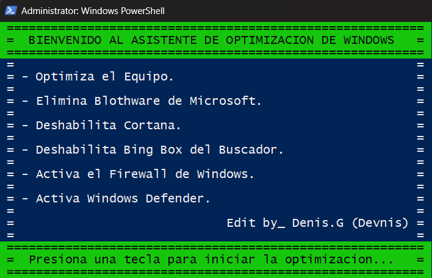
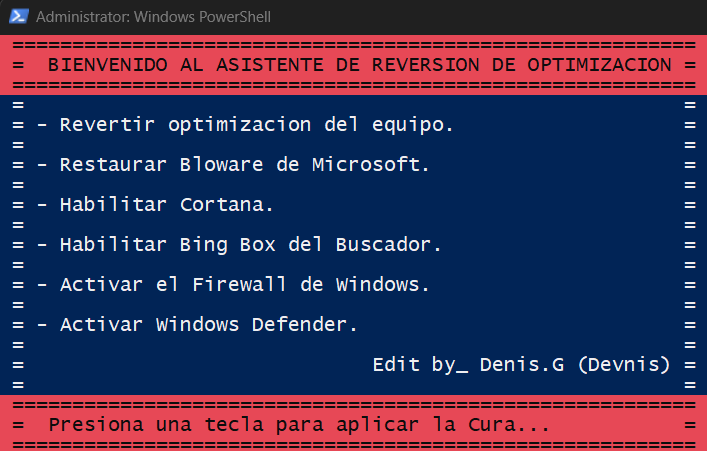

Este proyecto consta de dos scripts de PowerShell: Slay-Telemetry.ps1 y Reverter.ps1. El primero se encarga de optimizar el rendimiento de tu PC de bajos recursos, eliminando bloatware y realizando ajustes profundos en el sistema. El segundo script, Reverter.ps1, restaura las configuraciones originales y reinstala las aplicaciones eliminadas, permitiendo deshacer los cambios realizados por Slay-Telemetry.ps1.

Características de Slay-Telemetry.ps1:

- Eliminación de Bloatware: Desinstala aplicaciones innecesarias y no deseadas de Windows.
- Desactivación de Telemetría: Reduce la recopilación de datos de uso por parte de Microsoft.
- Optimización del Sistema: Realiza configuraciones para mejorar el rendimiento, como desactivar Cortana, - activar el Firewall y Windows Defender.
- Interfaz de Usuario: Proporciona una experiencia amigable mediante mensajes claros en la consola.

Uso de Slay-Telemetry.ps1:

- Descarga el script Reverter.ps1 desde el repositorio.

Comando Powershell: .\Slay-Telemetry.ps1

Características de Reverter.ps1:

- Restauración de Configuraciones: Revierte todos los cambios realizados por Slay-Telemetry.ps1.
- Reinstalación de Aplicaciones: Permite reinstalar bloatware que haya sido eliminado si así se desea.

Uso de Reverter.ps1:

- Descarga el script Reverter.ps1 desde el repositorio.

Comando Powershell: .\Reverter.ps1

Requisitos:

- Privilegios de administrador para ejecutar ambos scripts.
- Windows 10 o superior.
- Powershell.

======================

